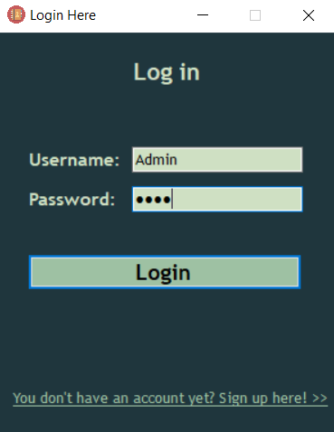
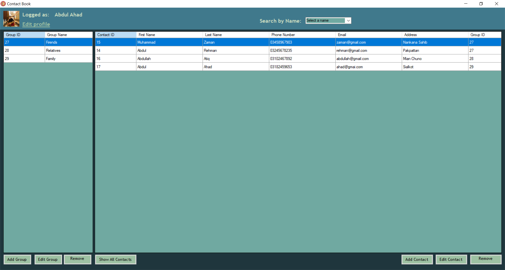
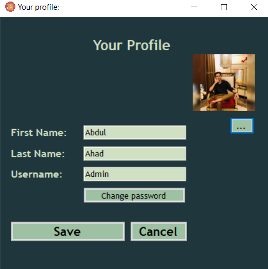
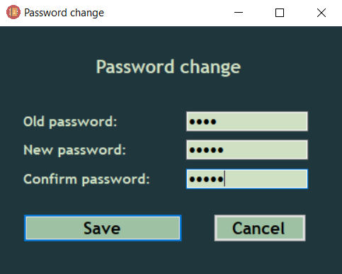

# 📇 Contact Book Management System

### Windows Forms Contact Management Application with Oracle Database Integration

<p align="center">


</p>

---

## Overview

Contact Book Management System is a desktop application developed using C# Windows Forms and Oracle 10g Database.

The system provides a centralized platform for managing personal and professional contacts through secure authentication, profile management, contact organization, group categorization, and advanced search functionality.

The application demonstrates Object-Oriented Programming (OOP), database integration, CRUD operations, and software engineering principles in a real-world desktop solution.

---

## Key Features

### User Authentication

* User Registration
* Secure Login System
* Password Validation
* User Session Management

### Contact Management

* Add Contacts
* Edit Contacts
* Delete Contacts
* View Contact Details
* Contact Search

### Group Management

* Create Groups
* Edit Groups
* Delete Groups
* Organize Contacts by Groups

### Profile Management

* View Profile
* Edit Profile
* Change Password
* Update Personal Information

### Search Functionality

Search contacts using:

* Name
* Email Address
* Phone Number

---

## Screenshots

### User Registration & Login



### Dashboard



### Profile Management



### Password Management



### Contact Management


### Group Management


---

## System Modules

### Authentication Module

Handles:

* User Registration
* User Login
* Credential Verification

### Contact Module

Handles:

* Create Contact
* Read Contact
* Update Contact
* Delete Contact

### Group Module

Handles:

* Create Group
* Edit Group
* Remove Group
* Contact Categorization

### Profile Module

Handles:

* Profile Updates
* Password Changes
* User Information Management

### Search Module

Allows users to quickly locate contacts using search filters.

---

## Technology Stack

### Programming Language

* C#

### Framework

* Windows Forms (.NET)

### Database

* Oracle 10g

### Development Concepts

* Object-Oriented Programming (OOP)
* CRUD Operations
* Database Connectivity
* Authentication Systems

### Tools

* Visual Studio
* Oracle SQL Developer
* Git
* GitHub

---

## Database Design

The system stores:

### Users

* User ID
* Username
* Password
* Profile Information

### Contacts

* Contact ID
* First Name
* Last Name
* Email
* Phone Number
* Address

### Groups

* Group ID
* Group Name

Contacts can be associated with groups for better organization.

---

## Functional Requirements

### High Priority

* User Registration & Login
* Contact Management
* Group Management
* Profile Management
* Search Functionality

### Medium Priority

* Data Validation
* Authentication Security

### Low Priority

* Data Export Features

These requirements were identified during project planning and documentation.

---

## Installation

### Clone Repository

```bash
git clone https://github.com/ahadbuilds/Contact-Book-WinForms.git
```

### Open Solution

```text
Contact_Book_Management_System.sln
```

### Configure Database

1. Install Oracle 10g
2. Execute SQL scripts from:

```text
Oracle Database SQL Queries.txt
```

3. Update connection string if required.

### Run Application

Open the project in Visual Studio and press:

```text
F5
```

---

## Software Engineering Concepts Applied

### Object-Oriented Programming

* Encapsulation
* Abstraction
* Modularity
* Reusability

### Database Concepts

* Relational Database Design
* SQL Queries
* CRUD Operations
* Data Validation

### User Experience

* Responsive Forms
* Simple Navigation
* Error Handling
* User-Friendly Interface

---

## Learning Outcomes

* Desktop Application Development
* C# Programming
* Windows Forms Development
* Oracle Database Integration
* CRUD Operations
* Authentication Systems
* Software Engineering Practices
* Object-Oriented Programming

---

## Future Enhancements

* Contact Import/Export
* Email Integration
* Cloud Synchronization
* Contact Backup & Recovery
* Role-Based Access Control
* Multi-User Support
* Modern UI Redesign

---

## Developer

* Abdul Ahad

Software Engineering Project

BS Computer Science University of Engineering & Technology (UET), Lahore

---

## License

Released for educational, academic, and portfolio purposes.
